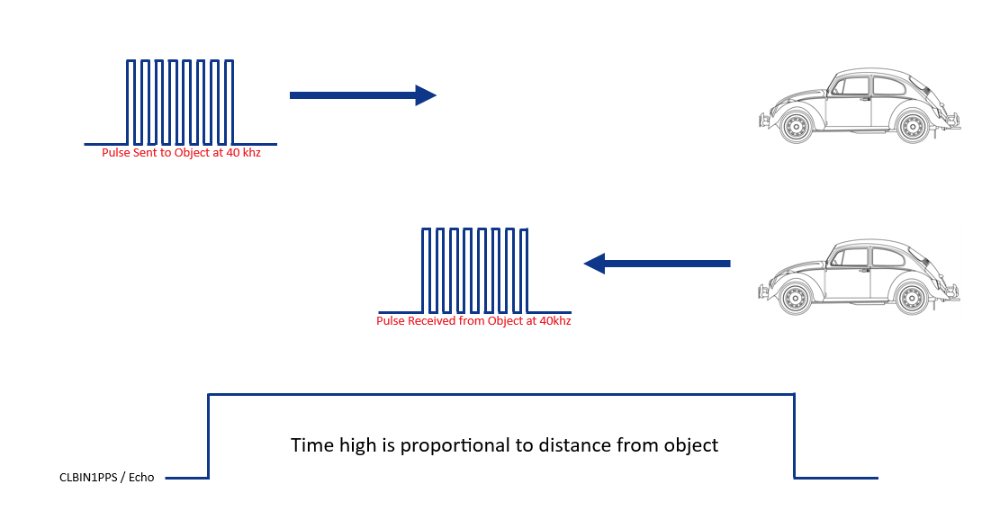
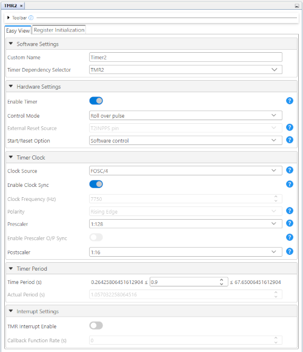

<!-- Please do not change this logo with link -->

<a target="_blank" href="https://www.microchip.com/" id="top-of-page">
   <picture>
      <source media="(prefers-color-scheme: light)" srcset="images/mchp_logo_light.png" width="350">
      <source media="(prefers-color-scheme: dark)" srcset="images/mchp_logo_dark.png" width="350">
      
   </picture>
</a>

# Zero-Software Ultrasonic Distance Sensing — Use Case for Configurable Logic Block (CLB) Using the PIC16F13145 Microcontroller with MCC Melody

This repository provides one projects that implement a rangefinder using the HC-SR04, and displaying the results on a eight LED's.

The CLB peripheral is a collection of logic elements that can be programmed to perform a variety of digital logic functions. The logic function may be completely combinatorial, sequential or a combination of the two, enabling users to incorporate hardware-based custom logic into their applications. 

The HC-SR04 is a standard ultrasonic sensor that can be used for object detection and distance sensing. This is accomplished by the transmitter sending a signal, and making a calculation based off the time it took the signal to get back to the reciever. 

The CLB will act as a logic handler, interpreting the HC-SR04 sensor data, and displaying it on eight LEDs.

## Related Documentation

More details and code examples on the PIC16F13145 can be found at the following links:

- [PIC16F13145 Product Page](https://www.microchip.com/en-us/product/PIC16F13145?utm_source=GitHub&utm_medium=TextLink&utm_campaign=MCU8_Apps_PIC16F13145&utm_content=pic16f13145-quadrature-decoder-up-down-mplab-mcc&utm_bu=MCU08)
- [PIC16F13145 Code Examples on Discover](https://mplab-discover.microchip.com/v2?dsl=PIC16F13145)
- [PIC16F13145 Code Examples on GitHub](https://github.com/microchip-pic-avr-examples/?q=PIC16F13145)

## Software Used

- [MPLAB X IDE v6.20 or newer](https://www.microchip.com/en-us/tools-resources/develop/mplab-x-ide?utm_source=GitHub&utm_medium=TextLink&utm_campaign=MCU8_Apps_PIC16F13145&utm_content=pic16f13145-quadrature-decoder-up-down-mplab-mcc&utm_bu=MCU08)
- [MPLAB® XC8 v2.46 or newer](https://www.microchip.com/en-us/tools-resources/develop/mplab-xc-compilers?utm_source=GitHub&utm_medium=TextLink&utm_campaign=MCU8_Apps_PIC16F13145&utm_content=pic16f13145-quadrature-decoder-up-down-mplab-mcc&utm_bu=MCU08)
- [PIC16F1xxxx_DFP v1.25.389 or newer](https://packs.download.microchip.com/)

## Hardware Used

- The [PIC16F13145 Curiosity Nano Development board](https://www.microchip.com/en-us/development-tool/EV06M52A?utm_source=GitHub&utm_medium=TextLink&utm_campaign=MCU8_Apps_PIC16F13145&utm_content=pic16f13145-quadrature-decoder-up-down-mplab-mcc&utm_bu=MCU08) is used as a test platform: <br>
- The HC-SR04 Ultrasonic distance sensor:<br>
- Seven LEDs
- 7 Resistors for LEDs (rec. 2.2kΩ)

## Operation

### All LEDs ON
 

This demonstration, shows the PIC16F13145 using a CLB configuration using verilog and the internal counter to keep every LED below the measured value HIGH while running.

### One LED ON
 

This demonstration, shows the PIC16F13145 using a CLB configuration using logic gates and the internal counter to keep only the measured LED HIGH while running.

These demonstrations show the CLB is a highly configurable and open ended tool.

## Concept
 

The HC-SR04 Sensor works by sending a series of pulses after the trigger pin has been toggled. These pulses will travel until they reach an object, and reflect back to the sensor if within range. This transaction is measured proportionally on the Echo pin, the pin will remain high if a signal is never received back. This means that the CLB can monitor the HC-SR04 by watching the echo pin.

 

Using the timer 0 overflow and the internal CLB counter we can use the echo line to sort itself out into bins that will be displayed on `COUNT_IS_X`

## Hardware Setup

1. Attach 7 LEDs in the following fashion.


You can attach the LEDs to any I/O but the pins used in this example are 
| PIN | LED # |
|--|--|
|RC6|1|
|RC7|2|
|RB7|3|
|RB5|4|
|RC0|5|
|RC1|6|
|RA4|7|
|RA5|8|

2. The HC-SR04 is connected to the Nano Board via 4 pins

<br>

| Nano Pin | HC-SR04 Pin |
|--|--|
|VTG|V<sub>CC</sub>|
|RB6|Trig|
|RB4|Echo|
|GND|GND|

**Important Note:** The HC-SR04 is uses 5 volts for inputs and outputs it is recommended to switch the Nano to 5V mode to avoid BOR. 

## MCC Setup

- Configuration Bits:
  -  Osillator not enabled
  -  HFINTOSC (32MHz)
  -  CLKOUT function disabled
  -  Interal analog systems are calibrated for operation between VDD = 2.3 - 5.5V

 <br>

- TMR2
  - Clock Source: FOSC/4
  - Prescalar: 1:128
  - Postscalar: 1:16
  - Time Period (s): 0.9
 
 <br>

- PWM1
  - Timer Dependency Selector: Timer2
  - Duty Cycle (%): 10
    
 <br>

- TMR0
  - Timer Mode: 8-bit
  - Clock Prescaler: 1:128
  - Clock Source: HFINTOSC 
  - Requested Period (s): 0.000584 
 <br>

- NVM
  - Auto-Configured by CLB

- CRC
  - Auto-Configured by CLB

- CLB
  -  Clock Selection: TMR0_Overflow

  <br>

- Pin Grid View
  - CLBPPSOUT0: RC6 (Closest Indicating LED)
  - CLBPPSOUT1: RC7
  - CLBPPSOUT2: RB7
  - CLBPPSOUT3: RB5
  - CLBPPSOUT4: RC0
  - CLBPPSOUT5: RC1
  - CLBPPSOUT6: RA4
  - CLBPPSOUT7: RA5 (Furthest Indicating LED)
  - CLBIN1PPS: RB4 (Echo Pin for HC-SR04)
  - PWM1OUT: RB6 (Trig Pin for HC-SR04)
 
<br>


## Comparison to Software

The CLB significantly reduces the software overhead associated with implementing this example. In software, you would have to manage a timer, a counter, and the IO's. These tasks involve managing pin placement (in some cases making sure there is an open row), checking the counter and/or timer is reloaded, or bit-masking. With the CLB, all of the functions associated with this example are handled by the hardware, which leaves the CPU free to do other tasks without interruption. 

## Theory of Operation

The CLB is a series of LUTs, similiar to an FPGA. In the PIC16F13145 family of MCUs, there are 32 LUTs available. To configure the logic, use the CLB Synthesizer tool inside of MCC (or the equivalant [standalone online tool](https://logic.microchip.com/clbsynthesizer/)). Logic diagrams are screenshots of the tool. All of the configuration files (.clb and .v) are included in the example folders. 

There are 2 configurations of this project. (Single LED and All LEDs) All previous settings will be the exact same for both these examples, the only change is the CLB bitstream. The following instructions are going to be applicable to the MCC CLB synthesizer or the Online Tool as well. **Important Note:** Any changes in the synthesizer will have to be synthesized first, and then `generate files` in MCC in order to take effect in hardware.


# All LEDs Active

For Single LED results the following submodule should be added within a `New Schematic` under documents on the synthesizer GUI.


The final result should look like this 


# Single LED Active

For Single LED results the following submodule should be added within a `New Verilog` under documents on the synthesizer GUI.


```
module led_all_counts(in1, in2, in3, in4, in5, in6, in7, in8, led10cm, led20cm, led30cm, led40cm, led50cm, led60cm, led70cm, led80cm);
input in1, in2, in3, in4, in5, in6, in7, in8;
output led10cm, led20cm, led30cm, led40cm, led50cm, led60cm, led70cm, led80cm;

assign led10cm = in1 | in2 | in3 | in4 | in5 | in6 | in7 | in8;
assign led10cm = in2 | in3 | in4 | in5 | in6 | in7 | in8;
assign led10cm = in3 | in4 | in5 | in6 | in7 | in8;
assign led10cm = in4 | in5 | in6 | in7 | in8;
assign led10cm = in5 | in6 | in7 | in8;
assign led10cm = in6 | in7 | in8;
assign led10cm = in7 | in8;
assign led10cm = in8;
endmodule
```

The final result should look like this 


## How to Program the Curiosity Nano

1. Connect the Curiosity Nano to the computer with a USB Type-C Cable.
2. Open the project folder in MPLAB X IDE.
3. Press the Programming Button (arrow into the microcontroller) on the top toolbar.  
   
4. Select the Curiosity Nano from the list.  