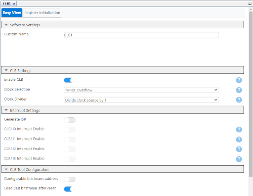
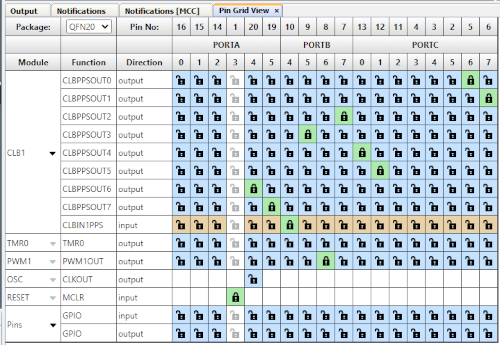
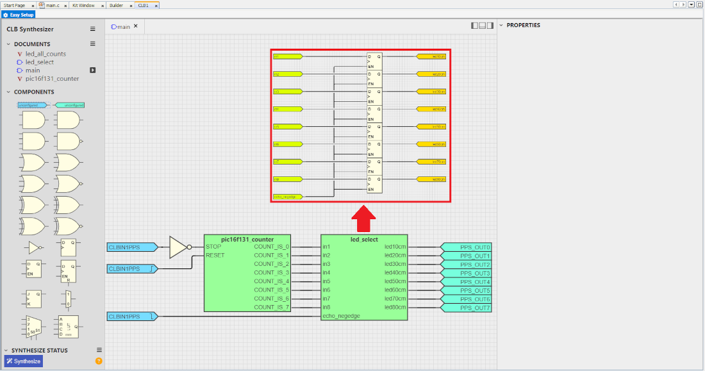

<!-- Please do not change this logo with link -->

<a target="_blank" href="https://www.microchip.com/" id="top-of-page">
   <picture>
      <source media="(prefers-color-scheme: light)" srcset="images/mchp_logo_light.png" width="350">
      <source media="(prefers-color-scheme: dark)" srcset="images/mchp_logo_dark.png" width="350">
      
   </picture>
</a>

# Zero-Software Ultrasonic Distance Sensing — Use Case for Configurable Logic Block (CLB) Using the PIC16F13145 Microcontroller with MCC Melody

This repository creates a rangefinder using the HC-SR04 ultrasonic sensor and displays the results on a bar-graph of eight LEDs.

The CLB peripheral is a collection of logic elements that can be configured to implement discrete logic function(s). The logic function may be completely combinatorial, sequential or a combination of the two, enabling users to incorporate hardware-based custom logic into their applications. 

The HC-SR04 is a standard ultrasonic sensor that can be used for object detection and distance sensing. This is accomplished by the transmitter sending a signal, and then calculating distance based on the time it took the signal to get back to the receiver. 

In this example, the CLB interprets the HC-SR04 sensor data and displays it on eight LEDs. This removes the need for the user to write any executable code. 

## Related Documentation

More details and code examples on the PIC16F13145 can be found at the following links:

- [PIC16F13145 Product Page](https://www.microchip.com/en-us/product/PIC16F13145?utm_source=GitHub&utm_medium=TextLink&utm_campaign=MCU8_Apps_PIC16F13145&utm_content=pic16f13145-quadrature-decoder-up-down-mplab-mcc&utm_bu=MCU08)
- [PIC16F13145 Code Examples on Discover](https://mplab-discover.microchip.com/v2?dsl=PIC16F13145)
- [PIC16F13145 Code Examples on GitHub](https://github.com/microchip-pic-avr-examples/?q=PIC16F13145)

## Software Used

- [MPLAB® X IDE v6.20 or newer](https://www.microchip.com/en-us/tools-resources/develop/mplab-x-ide?utm_source=GitHub&utm_medium=TextLink&utm_campaign=MCU8_Apps_PIC16F13145&utm_content=pic16f13145-quadrature-decoder-up-down-mplab-mcc&utm_bu=MCU08)
- [MPLAB® XC8 v2.46 or newer](https://www.microchip.com/en-us/tools-resources/develop/mplab-xc-compilers?utm_source=GitHub&utm_medium=TextLink&utm_campaign=MCU8_Apps_PIC16F13145&utm_content=pic16f13145-quadrature-decoder-up-down-mplab-mcc&utm_bu=MCU08)
- [PIC16F1xxxx_DFP v1.25.389 or newer](https://packs.download.microchip.com/)

## Hardware Used

- The [PIC16F13145 Curiosity Nano Development Board (EV06M52A)](https://www.microchip.com/en-us/development-tool/EV06M52A?utm_source=GitHub&utm_medium=TextLink&utm_campaign=MCU8_Apps_PIC16F13145&utm_content=pic16f13145-quadrature-decoder-up-down-mplab-mcc&utm_bu=MCU08) is used as a test platform: <br>
- The HC-SR04 Ultrasonic distance sensor:<br>
- Eight LEDs
- Eight Resistors for LEDs (recommended electrical resistance is 2.2 kΩ)

## Operation

### All LEDs ON
 

This demonstration shows the PIC16F13145 with a CLB configuration using Verilog and the internal counter to keep every LED below the measured value HIGH while running.

### One LED ON
 

This demonstration shows the PIC16F13145 with a CLB configuration using logic gates and the internal counter to keep only the measured LED HIGH while running.

The examples above showcase that the CLB is a highly configurable and open-ended tool.

## Theory of Operation
 

The HC-SR04 sensor works by sending a series of pulses after the trigger pin has been toggled. These pulses travel until they reach an object, are reflected back to the source. If the object is too far away, the sensor will not properly receive the pulse. The distance traveled is based on the length of time the Echo pin is kept high. By measuring the pulse width of the Echo pin, the CLB can determine the distance to the object.

 

To measure the pulse width, the Timer0 overflow and the internal CLB counter determine which bin the distance falls into.

## Hardware Setup

1. Attach eight LEDs in the following fashion.


The LEDs can be attached to any I/O, but the pins used in this example are the following:

| PIN | LED # |
|--|--|
|RC6|1|
|RC7|2|
|RB7|3|
|RB5|4|
|RC0|5|
|RC1|6|
|RA4|7|
|RA5|8|

2. Connect HC-SR04 to the Curiosity Nano via the four pins indicated in the table below.

<br>

| Nano Pin | HC-SR04 Pin |
|--|--|
|VTG|V<sub>CC</sub>|
|RB6|Trig|
|RB4|Echo|
|GND|GND|

**Important:** The HC-SR04 uses 5 volts for inputs and outputs. It is recommended to switch the Curiosity Nano to 5V mode to avoid the Brown-out Reset (BOR).

## MCC Setup

- Configuration Bits:
  -  Osillator not enabled
  -  HFINTOSC (32 MHz)
  -  CLKOUT function disabled
  -  Internal analog systems are calibrated for operation between V<sub>DD</sub> = 2.3 - 5.5V

<br>

- TMR2
  - Clock Source: FOSC/4
  - Prescalar: 1:128
  - Postscalar: 1:16
  - Time Period (s): 0.9
 
<br>

- PWM1
  - Timer Dependency Selector: Timer2
  - Duty Cycle (%): 10
    
<br>

- TMR0
  - Timer Mode: 8-bit
  - Clock Prescaler: 1:128
  - Clock Source: HFINTOSC 
  - Requested Period (s): 0.000584 

<br>

- NVM
  - Auto-Configured by CLB

- CRC
  - Auto-Configured by CLB

- CLB
  -  Clock Selection: TMR0_Overflow

<br>

- Pin Grid View
  - CLBPPSOUT0: RC6 (Closest Indicating LED)
  - CLBPPSOUT1: RC7
  - CLBPPSOUT2: RB7
  - CLBPPSOUT3: RB5
  - CLBPPSOUT4: RC0
  - CLBPPSOUT5: RC1
  - CLBPPSOUT6: RA4
  - CLBPPSOUT7: RA5 (Furthest Indicating LED)
  - CLBIN1PPS: RB4 (Echo Pin for HC-SR04)
  - PWM1OUT: RB6 (Trig Pin for HC-SR04)
 
<br>


## Comparison to Software

The CLB significantly reduces the software overhead associated with implementing this example. Usually, it is up to the software to handle a timer, counter, as well as the I/Os. These tasks involve managing pin placement (in some cases making sure there is an open row), checking the counter and/or timer is reloaded, or bit-masking. With the CLB, all functions associated with this example are handled by the hardware, which leaves the CPU free to do other tasks without interruption. 

## Theory of Operation

The CLB is a series of Look-up Tables (LUTs), similiar to an FPGA. In the PIC16F13145 family of microcontrollers (MCUs), there are 32 LUTs available. To configure the logic, use the CLB Synthesizer tool inside of  inside of MPLAB Code Configurator (MCC) (or the equivalant [stand-alone online tool](https://logic.microchip.com/clbsynthesizer/)). Logic diagrams are screenshots of the tool. All of the configuration files (`.clb` and `.v`) are included in the example folders. 

There are two configurations of this project: single LED and all LEDs. All previous settings will be the exact same for both examples, the only change being the CLB bitstream. The following instructions are going to be applicable to the MCC CLB synthesizer or the Online Tool as well. 

**Note:** Any changes in the synthesizer will have to be synthesized first, then the files need to be generated in MCC to take effect in hardware.


# All LEDs Active

For all LED results, add the following submodule within a `New Schematic` under documents on the synthesizer GUI.


The final result should look like this: 



# Single LED Active

For single LED results, add the following submodule within a `New Verilog` under documents on the synthesizer GUI.


```
module led_all_counts(in1, in2, in3, in4, in5, in6, in7, in8, led10cm, led20cm, led30cm, led40cm, led50cm, led60cm, led70cm, led80cm);
input in1, in2, in3, in4, in5, in6, in7, in8;
output led10cm, led20cm, led30cm, led40cm, led50cm, led60cm, led70cm, led80cm;

assign led10cm = in1 | in2 | in3 | in4 | in5 | in6 | in7 | in8;
assign led10cm = in2 | in3 | in4 | in5 | in6 | in7 | in8;
assign led10cm = in3 | in4 | in5 | in6 | in7 | in8;
assign led10cm = in4 | in5 | in6 | in7 | in8;
assign led10cm = in5 | in6 | in7 | in8;
assign led10cm = in6 | in7 | in8;
assign led10cm = in7 | in8;
assign led10cm = in8;
endmodule
```

The final result should look like this: 


## How to Program the Curiosity Nano

1. Connect the Curiosity Nano to the computer with a USB Type-C Cable.
2. Open the project folder in MPLAB X IDE.
3. Press the Programming Button (arrow into the microcontroller) on the top toolbar.  
   
4. Select the Curiosity Nano from the list.  